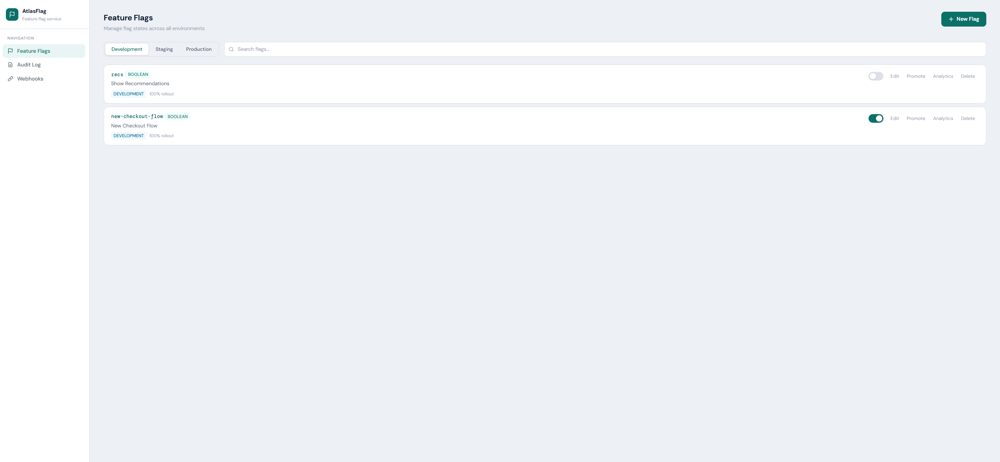
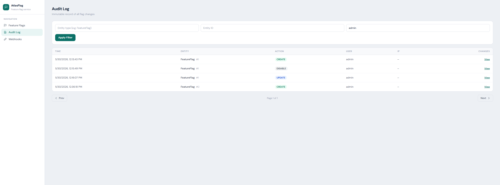

# AtlasFlag — Self-Hosted Feature Flag Service

> Deploy feature flags, percentage rollouts, and multi-environment configuration management on your own infrastructure. No SaaS. No vendor lock-in.

[](https://adoptium.net/)
[](https://spring.io/projects/spring-boot)
[](https://www.postgresql.org/)
[](LICENSE)
---

## What Is AtlasFlag?

AtlasFlag is a **self-hosted feature flag and configuration management platform** built with Spring Boot and PostgreSQL. It gives engineering teams full control over feature releases without depending on third-party services.

Use it to:
- **Decouple deploys from releases** — ship code dark, turn it on when ready
- **Run percentage rollouts** — expose a feature to 5% of users before full rollout
- **Manage per-environment flags** — different states for `DEVELOPMENT`, `STAGING`, `PRODUCTION`
- **Kill-switch bad features instantly** — toggle a flag off without a redeploy
- **Audit every change** — full immutable audit trail with before/after values

---

## Dashboard


*Feature flag management UI — create, toggle, and roll out flags across environments*


*Immutable audit trail — every change recorded with user, timestamp, and diff*


---

## Features

| Feature | Details |
|---|---|
| Boolean flags | Enabled/disabled with optional default value |
| Percentage rollouts | Deterministic, hash-based — same user always gets the same result |
| **User attribute targeting** | AND/OR rules on caller-supplied attributes (plan, country, email, etc.) |
| **Remote configuration** | STRING, NUMBER, JSON flag types — change config values without deploys |
| Multi-environment | `DEVELOPMENT`, `STAGING`, `PRODUCTION` with independent states |
| Environment promotion | One-click promote flag config to the next environment |
| Instant toggles | No cache invalidation delay — flags flip in under 100ms |
| **SSE streaming** | SDK cache updated in real-time via Server-Sent Events — no polling |
| **Evaluation analytics** | Per-flag hourly evaluation counts with true/false breakdown |
| Flag search | Filter flags by key as you type |
| Webhooks | HTTP notifications on every flag change, HMAC-SHA256 signed |
| In-memory cache | Caffeine-backed, zero external dependencies |
| Audit logging | Every change logged with before/after JSON |
| Role-based access | `ADMIN` · `USER` · `VIEWER` — enforced via JWT claims |
| User management | Create, edit, delete users and change passwords — UI + API (ADMIN only) |
| Java SDK | Bulk evaluation, local caching, SSE live updates, typed remote config, never throws |
| Bulk evaluation | Evaluate up to 100 flags in a single HTTP call |
| Web UI | Built-in dashboard — flags, audit logs, webhooks, analytics |
| REST API | Clean, versioned REST API (`/api/v1/...`) |
| Self-hosted | Your data stays in your database |
| Single-service deploy | Backend serves the dashboard — one deployment is all you need |

---

## Tech Stack

- **Backend:** Java 21 · Spring Boot 3.2 · Spring Security (JWT) · Spring Data JPA
- **Database:** PostgreSQL 16 · Flyway migrations
- **Cache:** Caffeine (in-memory) — no external cache server required
- **Frontend:** Vanilla JS · Tailwind CSS · Thymeleaf templates
- **SDK:** Java · OkHttp · Caffeine
- **Deploy:** Any Docker-compatible host — one service serves both dashboard and API

---

## Quick Start (5 minutes)

### Option A — Local with Docker

**Prerequisites:** Java 21, Docker

```bash
# 1. Start PostgreSQL
cd infra && docker-compose up -d && cd ..

# 2. Run the service
./gradlew :atlas-flag-service:bootRun

# 3. Open the dashboard
open http://localhost:8080
# Login: admin / admin123
```

### Option B — Deploy to a cloud host

See [DEPLOYMENT.md](DEPLOYMENT.md) for the full guide. TL;DR:

1. **Database:** Provision a PostgreSQL instance — grab the JDBC connection string
2. **Service:** Build the Docker image (`docker build -t atlasflag .`) and deploy — set the required env vars
3. Open `https://your-host/dashboard` — the Spring Boot app serves everything

---

## API Reference

All endpoints require `Authorization: Bearer <token>` except `/api/v1/auth/login` and `/api/v1/flags/evaluate`.

### Authentication

```bash
# Login — returns JWT token
curl -X POST http://localhost:8080/api/v1/auth/login \
  -H "Content-Type: application/json" \
  -d '{"username": "admin", "password": "admin123"}'
```

```json
{
  "token": "eyJ...",
  "type": "Bearer",
  "username": "admin",
  "role": "ADMIN"
}
```

### Feature Flags

```bash
TOKEN="eyJ..."

# Create a flag
curl -X POST http://localhost:8080/api/v1/flags \
  -H "Authorization: Bearer $TOKEN" \
  -H "Content-Type: application/json" \
  -d '{
    "flagKey": "new-checkout",
    "name": "New Checkout Flow",
    "environment": "DEVELOPMENT",
    "enabled": true,
    "rolloutPercentage": 10,
    "defaultValue": false
  }'

# List flags in an environment
curl "http://localhost:8080/api/v1/flags?environment=PRODUCTION" \
  -H "Authorization: Bearer $TOKEN"

# Toggle a flag on/off
curl -X POST "http://localhost:8080/api/v1/flags/new-checkout/toggle?environment=DEVELOPMENT" \
  -H "Authorization: Bearer $TOKEN"

# Evaluate a flag (public — no auth required)
curl -X POST http://localhost:8080/api/v1/flags/evaluate \
  -H "Content-Type: application/json" \
  -d '{"flagKey": "new-checkout", "environment": "PRODUCTION", "userId": "user-42"}'
```

### Audit Logs (ADMIN only)

```bash
# All changes to a specific flag
curl "http://localhost:8080/api/v1/audit/entity/FeatureFlag/1" \
  -H "Authorization: Bearer $TOKEN"

# All changes made by a user
curl "http://localhost:8080/api/v1/audit/user/admin" \
  -H "Authorization: Bearer $TOKEN"
```

Full API reference → [DETAILED.md](DETAILED.md#api-reference)

---

## Spring Boot Starter

The starter auto-configures `AtlasFlagClient` from `application.properties` and adds `@FeatureFlag` annotation support. No boilerplate required.

Build from source and publish to your local Maven repository:

```bash
./gradlew :atlas-flag-spring-boot-starter:publishToMavenLocal
```

```gradle
// build.gradle
dependencies {
    implementation 'com.atlasflag:atlas-flag-spring-boot-starter:1.0.0-SNAPSHOT'
    implementation 'org.springframework.boot:spring-boot-starter-aop'  // for @FeatureFlag
}
```

```yaml
# application.yml
atlasflag:
  base-url: https://your-atlasflag-host.com
  environment: PRODUCTION
  cache:
    ttl-seconds: 60
```

```java
@Service
public class CheckoutService {

    // Method is skipped (returns null) when "new-checkout" flag is disabled
    @FeatureFlag("new-checkout")
    public CheckoutResult runNewFlow(Order order) { ... }

    // Custom default and environment override
    @FeatureFlag(value = "beta-pricing", defaultValue = true, environment = "STAGING")
    public PricingResult computePrice(String userId) { ... }
}
```

```java
// Or inject AtlasFlagClient directly for full control
@Autowired AtlasFlagClient flags;

boolean enabled = flags.isEnabled("dark-mode", userId, false);
Map<String, Boolean> bulk = flags.isEnabledBulk(List.of("flag-a", "flag-b"), userId, false);
```

```java
// Bean only created when "experimental-cache" flag is enabled at startup
@Bean
@ConditionalOnFeatureFlag("experimental-cache")
public CacheManager experimentalCache() { ... }
```

**userId resolution:** By default, the starter reads the current user from Spring Security's `SecurityContext`. Override by registering your own `UserIdProvider` bean.

---

## Java SDK

The raw SDK (without Spring Boot auto-configuration). Build from source:

```bash
./gradlew :atlas-flag-sdk-java:publishToMavenLocal
```

```gradle
// build.gradle
dependencies {
    implementation 'com.atlasflag:atlas-flag-sdk-java:1.0.0-SNAPSHOT'
}
```

```java
AtlasFlagClient client = new AtlasFlagClient.Builder()
    .baseUrl("https://your-atlasflag-host.com")
    .environment("PRODUCTION")
    .cacheTtlSeconds(60)   // evaluated values cached locally for 60s
    .build();

// Never throws — returns defaultValue if service is unreachable
boolean showNewUI = client.isEnabled("new-checkout", "user-42", false);

client.shutdown(); // call when your app shuts down
```

The SDK caches evaluated results locally (Caffeine) and refreshes them in the background before they expire. If the service is unreachable, it serves stale cached values and falls back to `defaultValue` only as a last resort.

---

## Architecture

```
Browser / SDK Clients
        │
        ▼
┌──────────────────────────────┐
│  Spring Boot Service (8080)  │
│  ┌────────────┐  ┌────────┐  │
│  │ REST API   │  │ Web UI │  │
│  └─────┬──────┘  └────────┘  │
│        │                     │
│  ┌─────▼──────────────────┐  │
│  │  Feature Flag Service  │  │
│  │  + Caffeine Cache      │  │
│  └─────┬──────────────────┘  │
└────────┼─────────────────────┘
         │
         ▼
   PostgreSQL 16
   (flags · users · audit_logs)
```

Evaluation path: `GET /flags/evaluate` → cache lookup → DB read on miss → cache write → response. Typical p99 < 5ms when cached.

Full architecture → [DETAILED.md](DETAILED.md#architecture)

---

## Environment Variables

| Variable | Required | Default | Description |
|---|---|---|---|
| `DATABASE_URL` | Yes | `jdbc:postgresql://localhost:5432/atlasflag` | PostgreSQL JDBC URL |
| `DATABASE_USERNAME` | Yes | `atlasflag` | DB username |
| `DATABASE_PASSWORD` | Yes | `atlasflag` | DB password |
| `JWT_SECRET` | Yes in prod | dev default | Min 32 chars · change in production |
| `CORS_ALLOWED_ORIGINS` | Prod | localhost | Comma-separated allowed origins |
| `PORT` | No | `8080` | HTTP port |
| `DB_POOL_SIZE` | No | `5` | HikariCP max connections |
| `DB_SSL_MODE` | No | `prefer` | Set to `require` for cloud PostgreSQL providers |

---

## Default Credentials

The service seeds an admin user on first startup:

| Field | Value |
|---|---|
| Username | `admin` |
| Password | `admin123` |
| Role | `ADMIN` |

**Change this password immediately in production.**

---

## Project Structure

```
atlas-flag/
├── service/                    # Spring Boot backend
│   ├── src/main/java/          # Application code
│   ├── src/main/resources/
│   │   ├── templates/          # Thymeleaf HTML (dashboard, login)
│   │   ├── static/js/app.js    # Frontend JS
│   │   └── db/migration/       # Flyway SQL migrations
│   └── build.gradle
├── sdk-java/                   # Java client SDK
├── infra/
│   └── docker-compose.yml      # PostgreSQL for local dev
├── CLAUDE.md                   # AI assistant context + project commands
├── DETAILED.md                 # Full technical documentation
├── QUICKSTART.md               # 5-minute setup guide
└── SETUP.md                    # Java environment setup
```


---

## Roadmap

- [x] Boolean flags with percentage rollouts
- [x] Multi-environment flag management (DEVELOPMENT → STAGING → PRODUCTION)
- [x] Environment promotion (one-click copy flag config to next environment)
- [x] Flag search / filter
- [x] Java SDK — bulk evaluation, local caching, background refresh
- [x] Bulk evaluate endpoint (`POST /api/v1/flags/evaluate/bulk`)
- [x] Webhook notifications on flag change (HMAC-SHA256 signed)
- [x] Immutable audit trail
- [x] JWT authentication + RBAC (ADMIN · USER · VIEWER)
- [x] User management API
- [x] User management UI (create, edit, delete users, change passwords)
- [x] Web UI dashboard (flags · audit logs · webhooks)
- [x] Caffeine in-memory cache (no Redis needed)
- [x] User attribute targeting (AND/OR rules, 11 operators)
- [x] Remote configuration (STRING/NUMBER/JSON flag types)
- [x] Evaluation analytics (hourly counters, 24h dashboard view)
- [x] SSE streaming (SDK cache updated in real-time)
- [ ] Approval workflows
- [ ] Scheduled flag changes
- [ ] Python / Node.js / Go SDKs
- [ ] A/B testing integration

---

## Contributing

Bug reports, feature requests, and pull requests are welcome. See [CONTRIBUTING.md](CONTRIBUTING.md) for development setup, code conventions, and the PR process.

---

## License

MIT — see [LICENSE](LICENSE)

---

**Topics:** `feature-flags` `feature-toggles` `spring-boot` `java` `postgresql` `self-hosted` `rest-api` `feature-management` `sdk` `rollout` `jwt` `open-source`
